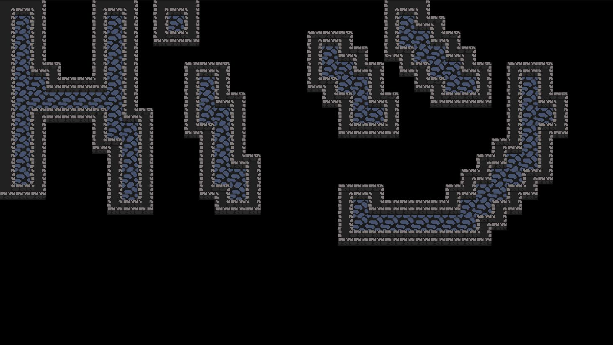

# RU — AutoTile Click Canvas

**Логическая сетка** `W×H`. Одна логическая клетка рендерится как **2×2** сабтайла.

**ЛКМ** ставит пол; **ПКМ** очищает клетку.

**После каждого клика:**

1. Строится бинарная маска пола.
2. По внешнему периметру этой маски (8-связность) вычисляется маска стен.
3. Для каждой логической клетки берутся соседи и через `AutoTileMath.quad(...)` выбираются 4 индекса (TL, TR, BL, BR) из набора **48** тайлов.
4. На слой **Floor** кладутся 2×2 сабтайла пола, на слой **Solid** — 2×2 сабтайла стен.

**Управление**

* **ЛКМ** — поставить пол.
* **ПКМ** — стереть пол.

**Быстрый старт (Vite)**

```bash
npm i
npm run dev
```

Откройте проект в браузере и кликайте по канвасу: ЛКМ — ставит пол, ПКМ — стирает; стены и автотайлинг пересчитываются автоматически.

---

# EN — AutoTile Click Canvas

**Logical grid** `W×H`. Each logical cell renders as **2×2** subtiles.

**Left-click** places floor; **Right-click** clears the cell.

**After each click:**

1. Build a binary floor mask.
2. From the outer perimeter of that mask (8-connectivity), compute a wall mask.
3. For every logical cell, look up its neighbors and use `AutoTileMath.quad(...)` to pick 4 indices (TL, TR, BL, BR) from the **48-tile** set.
4. Place the 2×2 floor subtiles on the **Floor** layer and the 2×2 wall subtiles on the **Solid** layer.

**Controls**

* **Left-click** — place floor.
* **Right-click** — erase floor.

**Quick Start (with Vite)**

```bash
npm i
npm run dev
```

Open in your browser and click on the canvas: left-click places floor, right-click erases it; walls and autotiling are recalculated automatically.
